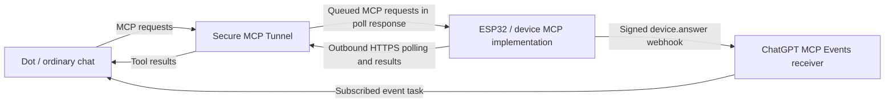

# dots-device

A small ESP32 companion for your OpenAI Dot: an animated character, short conversation summaries, and questions you can answer by touch. Keep the main conversation in chat and use the device for a glance or a quick reply.

This experimental, independent project provides firmware, character converters, example configuration, and Dot instructions. It is not official OpenAI hardware or an SDK.

**[Get started](docs/getting-started.md)** · **Communication specification: [English](docs/communication-spec.md) / [日本語](docs/communication-spec.ja.md)**

## On the device

- Your own animated character. Tilt the screen to move it left or right; place it flat to bring it back to the left. Tap the character to wave.
- Short Japanese summaries in a speech bubble. The bubble uses the opposite side of the screen, hides during movement, and reappears when the character settles. Tap the bubble to hide or show it.
- Touch answers with up to four choices, displayed two at a time. The question scrolls on the left; answer buttons stay on the right. One tap returns HOME immediately, with persistence and delivery handled by the background task.
- Icon menus, page navigation, and saved light/dark themes. Connection indicators stay small; detailed diagnostics are available over serial.

The target is **Waveshare ESP32-C6-Touch-LCD-1.47**: a 320×172 landscape touch display, QMI8658 IMU, and 8 MB of flash. It has no microphone; voice input is not implemented. Other boards need changes to drivers, pins, sensor axes, touch coordinates, and memory layout. [Manufacturer documentation](https://docs.waveshare.com/ESP32-C6-Touch-LCD-1.47) · [Firmware details](firmware/README.md)

## Two complementary communication paths

The ESP32 connects outward over Wi-Fi and HTTPS. In direct mode, it runs both the project's tunnel client and device MCP implementation, so a Mac relay and a public listener on the device are unnecessary.

| Path | Role in this project |
| --- | --- |
| **Secure MCP Tunnel** | Carries tool calls and their results: publish a summary or question, read a saved answer, record a receipt, and inspect status. Event discovery and subscription methods use this same MCP route. |
| **MCP Events** | Sends a signed `device.answer` webhook from the ESP32 to ChatGPT's event receiver. The notification triggers the subscribed Dot to read and process the answer. |



MCP Events complements the tunnel: it provides the notification that an answer is ready. The Dot then reads the persisted answer through the tunnel. A webhook's HTTP success means the event was accepted, not that the Dot has replied in chat or recorded a receipt.

The firmware contains a custom ESP32 tunnel client; it does not run the official desktop `tunnel-client` binary. Review the official [Secure MCP Tunnel](https://developers.openai.com/api/docs/guides/secure-mcp-tunnels) and [MCP Events](https://developers.openai.com/plugins/build/mcp-events) requirements. Each builder uses their own tunnel and connection. Publishing this source does not distribute a public ChatGPT plugin; the tunnel service is for private connections, including developer-mode testing.

## Chat → device → chat

1. The Dot replies in ordinary chat, then calls `device_publish_summary` for a short device summary. When a real choice is needed, it calls `device_publish_question` instead.
2. The ESP32 receives the tool request through its HTTPS poll and displays the summary or question.
3. A choice tap returns HOME immediately. The background task saves the answer in NVS before waiting for Wi-Fi or a valid clock, then sends `device.answer` when delivery is possible.
4. The subscribed Dot receives the event, calls `device_read_answer` for that question, and matches the question, choice, and request IDs to the question it published.
5. The Dot acknowledges the answer in ordinary chat and calls `device_record_receipt`. Later conversation summaries can update the device again.

For example, the arguments to `device_publish_question` are:

```json
{
  "question_id": "demo-drink-001",
  "text": "今飲むならどっち？",
  "choices": [
    {"id": "coffee", "label": "コーヒー"},
    {"id": "tea", "label": "お茶"}
  ]
}
```

This JSON belongs in a tool call, not in the chat reply. The device does not parse the ordinary chat transcript. The [English specification](docs/communication-spec.md) / [日本語の仕様](docs/communication-spec.ja.md) includes the sequence diagram, tool and event examples, ID mapping, persistence, retry limits, and receipt semantics.

## Build your own

1. **Prepare the board and demo.** Follow [Getting started](docs/getting-started.md) for the pinned libraries, bundled procedural character, configuration examples, build, and USB flashing. Start on USB power.
2. **Connect your Dot.** Create your own tunnel and runtime key, configure Wi-Fi locally, and connect the device tools in the intended ChatGPT workspace. Platform tunnel permissions and ChatGPT workspace permissions are separate.
3. **Enable answer events.** Discover and subscribe to `device.answer` in the intended Dot, verify the callback, and retain the subscription. Tool access alone does not enable event-triggered replies; the example `DIRECT_SUB` value `{}` does not create a subscription.
4. **Give the Dot both instructions.** Use the [instruction template](docs/dot-instructions.md) for ordinary-chat summaries/questions and event-triggered answer handling. Keep device JSON out of chat. Skip unavailable-device operations quietly while continuing the conversation.
5. **Verify the whole loop.** Use the [normal-chat acceptance procedure](docs/normal-chat-device-flow.md): question display, answer persistence, event delivery, Dot acknowledgement, matching receipt, and a subsequent new summary.
6. **Replace the demo character.** Ask your Dot to prepare a sprite sheet and manifest in the [supported format](docs/character-assets.md), then import them with the converter. Keep private artwork and configuration in ignored local paths; the public demo needs no private character assets.

The schedule and message buttons are query entry points. Calendar and messaging access must be supplied by your Dot's own connected tools and instructions; the device itself does not implement those service integrations.

## Status and practical limits

- The direct question → persisted answer → MCP Events → Dot chat acknowledgement → matching device receipt route has been exercised on hardware with a serial-injected diagnostic tap. This is separate from physical-touch acceptance on your own board.
- Summaries and questions depend on the Dot calling tools. Saved instructions are not a hook that captures every chat reply, and chat delivery and device delivery are separate operations rather than guaranteed parallel execution.
- The firmware retains one current question/answer and one subscription/outbox. Retries are bounded; a recorded selection, accepted webhook, and Dot receipt are different states. There is no guaranteed response time or exactly-once conversation processing.
- Intermittent Wi-Fi authentication delays remain under investigation. Serial `health` reports startup connection milestones, reconnect counters, sensor initialization, and minimum heap. The [connection tracer](docs/troubleshooting.md#接続状態を連続記録する) records their changes without requesting a reset or reconnect.
- **Battery-only Wi-Fi stability remains unresolved.** USB operation and battery-side ADC measurements do not prove battery-only stability.

## Documentation and licensing

| Guide | Use it for |
| --- | --- |
| [Communication specification — English](docs/communication-spec.md) / [日本語](docs/communication-spec.ja.md) | Protocol roles, diagrams, JSON, subscriptions, and delivery semantics |
| [Getting started](docs/getting-started.md) | Environment, assets, configuration, build, and flashing |
| [Architecture](docs/architecture.md) | Firmware modules, UI, sensors, and networking |
| [Dot instructions](docs/dot-instructions.md) | Conversation summaries, questions, and answer handling |
| [Character assets](docs/character-assets.md) / [Font assets](docs/font-assets.md) | Custom sprites and Japanese font generation |
| [Troubleshooting](docs/troubleshooting.md) | Device health, Wi-Fi, input, and power diagnosis |
| [Event delivery troubleshooting](docs/event-delivery-troubleshooting.md) | Accepted events, question provenance, and owner-conversation delivery |
| [Third-party inventory](docs/third-party-inventory.md) / [Public readiness](docs/public-readiness.md) | Dependencies and remaining release work |

Several implementation and setup guides are currently in Japanese. The old [Mac relay](bridge/README.md) remains a separate legacy development/recovery path; new setups should start with direct HTTPS.

Original code, documentation, and the procedural demo are [MIT-licensed](LICENSE). The Japanese atlas is derived from Noto Sans CJK JP under the [OFL](licenses/NotoSansCJK-OFL.txt). Dependencies retain their own [licenses and notices](THIRD_PARTY_NOTICES.md).
