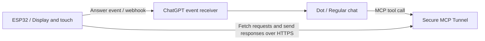

# dots-device

This is an experimental project that puts a character on a small ESP32 display, receives short summaries and questions from OpenAI's Dots, and lets you answer by touch. It collects implementation examples for people who want to build their own Dots device with an ESP32, covering the display, tilt, communication, and answer round trip. This is not official OpenAI hardware or an SDK.

## What can it do?

- Character animation. When placed flat, it settles on the left; when tilted, it moves in the direction of gravity.
- Short Japanese summaries shown in a speech bubble. The bubble appears on the side opposite the character, disappears while the character is moving, and reappears once it settles. You can also hide or show it by tapping.
- Questions scroll on the left, with two answer buttons at a time on the right. One tap queues an answer and returns immediately to the home screen.
- Page navigation, icon menus, and saved light/dark themes.
- Wi-Fi and peer-communication indicators at the bottom. Check detailed communication diagnostics on the serial side.
- A direct HTTPS connection over Wi-Fi. The direct mode does not require a Mac relay.

The schedule and message buttons are entry points for queries. The device alone does not complete integration with calendars or every messaging service; a destination and instructions on the Dot side are required. This board has no microphone, and voice input is not implemented.

## Target hardware

The current hardware target is **Waveshare ESP32-C6-Touch-LCD-1.47**. It uses a 320×172 landscape display, touch input, a QMI8658 IMU, and 8MB of flash. Other ESP32 boards are not expected to work unchanged. For a port, adapt the display driver, pins, touch coordinates, IMU axes, and flash capacity.

[Board documentation from the manufacturer](https://docs.waveshare.com/ESP32-C6-Touch-LCD-1.47) / [Pins and firmware](firmware/README.md)

## Reading order

1. [Getting started](docs/getting-started.md): Requirements, local configuration, asset preparation, build, and flashing.
2. [Architecture and communication flow](docs/architecture.md): How a question arrives from the Dot and an answer returns, with a map of the source files to read.
3. [Instruction template for the Dot](docs/dot-instructions.md): Summaries, choices, answer receipt, and what to do when a connection cannot be made.
4. [Replacing the character](docs/character-assets.md): Sprite dimensions and four animation slots.
5. [Troubleshooting](docs/troubleshooting.md): Isolating Wi-Fi, reception, answer delays, tilt, and power issues. [Accepted events and unavailable Dot chat](docs/event-delivery-troubleshooting.md): Tracing receiver and conversation delivery separately.
6. [Third-party libraries and sources](docs/third-party-inventory.md) / [Remaining public-release work](docs/public-readiness.md).

Several of the linked guides remain in Japanese.

## Connection model

This setup lets you continue a normal conversation with the Dot while separately sending short summaries and multiple-choice questions to the device. Merely displaying JSON in the chat does not deliver it to the device. The Dot side must call the device tools and subscribe to answer events.

Review the official requirements for [Secure MCP Tunnel](https://developers.openai.com/api/docs/guides/secure-mcp-tunnels) and [MCP Events](https://developers.openai.com/plugins/build/mcp-events). A personal connection through a tunnel is separate from a publicly distributed plugin. The intended use is for each person to run the public source through their own tunnel.

## Current status and limitations

On the physical device, we have confirmed the round trip in which a normal Dot sends a question, a physical button provides the answer, and the peer receives it. However, there is no guarantee that every conversation will be delivered to the device automatically, or that response times will meet a particular target.

Operation from USB power and stable operation on battery alone are separate validations. The problem of the device crashing when connected to Wi-Fi on battery power alone remains unresolved.

You can start by building with the bundled demo character and configuration example in [Getting started](docs/getting-started.md). Import your own character with the converter described in [Replacing the character](docs/character-assets.md); keep private artwork and configuration in local ignored paths. The Japanese atlas is derived from Noto Sans CJK JP and distributed under the [OFL terms](licenses/NotoSansCJK-OFL.txt).

The original code, documentation, and generated demo character are licensed under [MIT](LICENSE). Review the [respective terms](THIRD_PARTY_NOTICES.md) for dependencies and fonts. Documentation for the old Mac relay path remains available, but new setups should begin with the direct HTTPS getting-started guide.
