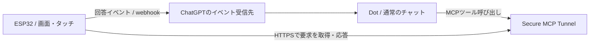

# dots-device

ESP32の小さな画面にキャラクターを住まわせ、OpenAIのDotsから短い要約や質問を受け取り、タッチで回答する実験プロジェクトです。ESP32で自分のDots端末を作りたい人に、画面・傾き・通信・回答の往復を実装する参考として役立つ実装例をまとめています。OpenAI公式のハードウェアやSDKではありません。

## 何ができる？

- キャラクターのアニメーション。平らに置くと左に落ち着き、傾けると重力方向へ動きます。
- 日本語の短い要約を吹き出し表示。吹き出しはキャラの反対側に出し、移動中は消えて落ち着くと再表示します。タップによる非表示／再表示もできます。
- 質問は左側をスクロール、回答ボタンは右側に2つずつ表示。1回のタップで回答をキューに入れ、すぐホームに戻ります。
- ページ移動、アイコン付きメニュー、保存されるノーマル／ダークテーマ。
- 下部にWi-Fiと相手側通信のインジケータ。詳細な通信診断はシリアル側で確認します。
- Wi-FiからHTTPSで直接接続。直接モードの運用にMac中継は不要です。

予定・メッセージのボタンは問い合わせの入口です。カレンダーや全メッセージサービスとの連携が端末だけで完成するわけではなく、Dot側の接続先と指示が必要です。このボードにマイクはなく、音声入力は実装していません。

## 対象ハードウェア

現在の実機対象は **Waveshare ESP32-C6-Touch-LCD-1.47** です。320×172の横長画面、タッチ、QMI8658 IMU、8MBフラッシュを利用します。他のESP32ボードはそのまま動作する対象ではありません。移植する場合は画面ドライバ、ピン、タッチ座標、IMU軸、フラッシュ容量を合わせてください。

[メーカーのボード資料](https://docs.waveshare.com/ESP32-C6-Touch-LCD-1.47)／[ピンとファームウェア](firmware/README.md)

## 最初に読む順番

1. [導入手順](docs/getting-started.md)：必要なもの、ローカル設定、素材の用意、ビルドと書き込み。
2. [構成と通信の流れ](docs/architecture.md)：Dotから質問が届き、回答が戻るまで。読むべきソースの対応表。
3. [Dotへ渡す指示テンプレート](docs/dot-instructions.md)：要約、選択肢、回答受領、接続できない時の扱い。
4. [キャラクター差し替え](docs/character-assets.md)：スプライトの寸法と4つの動作スロット。
5. [トラブル対処](docs/troubleshooting.md)：Wi-Fi、受信、回答遅延、傾き、電源を切り分ける。
6. [依存ライブラリと出典](docs/third-party-inventory.md)／[公開に向けた残作業](docs/public-readiness.md)。

## 接続の考え方

Dotとの通常の会話を続けながら、端末へ短い要約や選択式の質問を別に送る構成です。チャットにJSONを表示するだけでは端末には届きません。Dot側が端末ツールを呼び、回答イベントを購読する必要があります。

[Secure MCP Tunnel](https://developers.openai.com/api/docs/guides/secure-mcp-tunnels)と[MCP Events](https://developers.openai.com/plugins/build/mcp-events)の公式条件を確認してください。トンネルによる個人用の接続と、一般配布する公開プラグインは別です。公開ソースを各自が自分のトンネルで使う形を想定しています。

## 現在地と制限

実機では通常のDotから質問を受け、物理ボタンで回答し、相手側が受領する往復を確認しています。ただし、すべての会話が自動で端末に配信される保証や、応答時間の保証はありません。

USB給電での動作と、バッテリー単独での安定動作は別の検証です。バッテリーだけでWi-Fi接続時に落ちる問題は未解決です。

まず[導入手順](docs/getting-started.md)のデモキャラクターと設定例でビルドできます。KAIの素材は `.local/characters/kai/` に置き、配布物には含めません。ソース内の `kai_*` は現行の命名で、自分のキャラクターに差し替えられます。日本語アトラスはNoto Sans CJK JP由来で、[OFLの条件](licenses/NotoSansCJK-OFL.txt)で配布します。

オリジナルのコード・文書・生成デモキャラクターは[MIT](LICENSE)です。依存ライブラリやフォントは[それぞれの条件](THIRD_PARTY_NOTICES.md)を確認してください。旧Mac中継向け文書も残していますが、新規導入は直接HTTPSの導入手順から始めてください。
