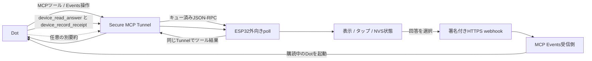
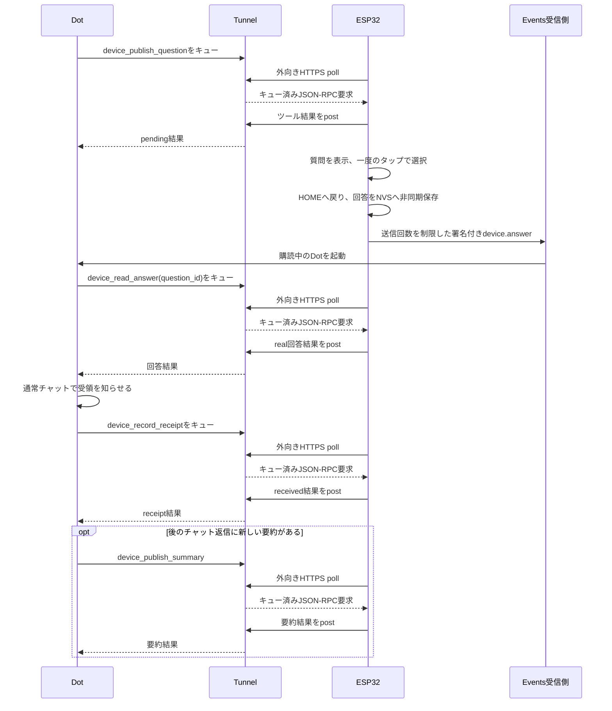

# Dot ↔ ESP32 通信仕様

この文書は、このリポジトリの現行の直接HTTPS実装を説明します。接続先の
アシスタントは一般名として **Dot** と表記します。ソースのファイル名には
過去の `kai_companion` が残る場合があります。英語版は
[communication-spec.md](communication-spec.md) です。

## 範囲と役割

端末はMCP 2.0（プロトコルバージョン `2026-07-28`）のサーバーであり、ESP32
独自の外向きポーリングクライアントから到達します。OpenAI公式の
`tunnel-client` はPCまたはサーバーで動かす別のクライアントで、ファームウェア
には含めません。端末は外向きHTTPSを開き、キューにあるJSON-RPCをpollし、同じ
トンネルで結果を返します。直接経路には外部からの公開リスナーもMac中継も
ありません。

Secure MCP Tunnelはツール呼び出しと購読操作を運びます。MCP Eventsは別の
外向きWebhook通知であり、回答が新しく存在することを購読中のDotへ知らせます。
`device_read_answer`やツール経路の代わりではありません。詳細は
[公式Secure MCP Tunnelガイド](https://developers.openai.com/api/docs/guides/secure-mcp-tunnels)
と[公式MCP Eventsガイド](https://developers.openai.com/plugins/build/mcp-events)
を参照してください。



回答の経路は次のとおりです。



## 状態と安全境界

ファームウェアが保持するのは、現在の質問1件、回答1件、要約表示1件、Events
購読1件、イベントoutbox1件です。無制限の回答履歴ではありません。receiptの
ない選択済み回答がある間は新しい質問を拒否します。同じ質問IDで同じ本文と
候補を再送すると冪等ですが、内容を変えると競合です。要約は別に送れますが、
未回答の質問を受領したことにはなりません。Dotの指示は未回答質問の置換を
防ぎ、要約が質問を覆わないよう保護しますが、ファームウェアの不変条件では
ありません。そのため質問も表示も技術的には置き換えられます。

選択時は空でない質問IDと候補IDを検証し、回答を `real` として `interaction_id`、
`choice_id`、`request_id` とともに保持します。UIは直ちにHOMEへ戻ります。
回答のNVS書き込みは回答タスクが非同期に行い、Wi-Fiと時計のゲートより前に
実施されます。同期的なUI耐久性を保証するものではありません。したがって、
選択表示、Webhook受理、Dotの読取り、通常チャット通知、receipt永続化は別々の
証拠です。

回答状態のNVSを開けない場合、保存JSONを読めない場合、またはJSONがオブジェクトで
ない場合、`device_status` は `storage_ready: false` を返します。回答の読取りと
書込みは `Device storage unavailable` エラーになり、新しい質問で保存状態を
上書きしません。ストレージの診断が必要です。自動再送や、読めない回答への
receipt作成で復旧しようとしないでください。

質問の候補は1〜4個で、画面は1ページに最大2個を表示します。質問IDと本文はUTF-8でそれぞれ128バイト、4096バイト
までです。各候補の一意な `id` は48バイト以内、空でない `label` は128バイト
以内です。要約IDは128バイト以内、要約本文は空でなくUnicodeコードポイント
24個以内です（バイト数ではありません）。端末は現在値だけを保存します。
これらは検証上限であり、画面への収まりを保証しません。320×172画面向けに
質問文と候補ラベルは短くします。

## MCPツール

| ツール | 必須入力 | 結果と意味 |
| --- | --- | --- |
| `device_publish_question` | `question_id`、`text`、`choices:[{id,label}]` | 保留中のreal質問を保存。同じIDと内容なら冪等、receipt待ちの回答があれば `Previous answer awaits receipt`。 |
| `device_publish_summary` | `summary_id`、`text` | 短い要約を保存して表示。同じIDと内容なら冪等、回答受領は意味しない。 |
| `device_read_answer` | 任意の `question_id` | 範囲が一致する現在の回答だけ返す。Dotは `source: real`、各ID、自分が出した質問を検証する。`source: real` はファームウェア経路を示すだけで、物理タップの証明ではない（シリアル注入も同じ経路を使える）。 |
| `device_record_receipt` | `interaction_id`、`choice_id`、`receipt_id`、`summary` | 一致するreceiptを保存。同じreceiptの再送は冪等、別のreceiptは競合。 |
| `device_status` | 引数なし | 直接経路とEventsのカウンタ/outbox状態を返す。Dot処理やチャット配信の証明ではない。 |

ツール引数は `snake_case`、イベント本文は `camelCase` です。
`question_id = answer.interaction_id = event.data.questionId` です。イベントの `answerId` は安定した
`questionId:choiceId:requestId` の組です。再試行では `request_id` を安定させ、
receiptにはそのrequestに基づく安定した `receipt_id` を使います。読んでいない
回答のreceiptを作ってはいけません。

## 合成例

以下は仕様説明用の固定例であり、実際のIDや送信ではありません。

質問ツール呼び出し:

```json
{
  "question_id": "demo-food-001",
  "text": "昼食は？",
  "choices": [{"id":"ramen","label":"ラーメン"},{"id":"curry","label":"カレー"}]
}
```

質問とは別の要約ツール呼び出し:

```json
{"summary_id":"chat-001","text":"会議は15時に変更"}
```

読取り要求（ツール引数）:

```json
{"question_id":"demo-food-001"}
```

読取り結果（完全なJSON-RPCではなく `structuredContent` の抜粋）:

```json
{"answers":[{"interaction_id":"demo-food-001","choice_id":"ramen","request_id":"req-001","source":"real","receipt_id":null}]}
```

receiptツール呼び出し:

```json
{"interaction_id":"demo-food-001","choice_id":"ramen","receipt_id":"rcpt-req-001","summary":"ラーメンを受領"}
```

署名付き `device.answer` Webhookの本文は次の形です。

```json
{
  "eventId":"evt_example",
  "name":"device.answer",
  "timestamp":"2026-01-01T00:00:00Z",
  "cursor":null,
  "data":{"answerId":"demo-food-001:ramen:req-001","questionId":"demo-food-001","choiceId":"ramen","requestId":"req-001","summary":null}
}
```

ファームウェアは保存済みWebhook secretで、シリアライズ済み要求バイト列そのものを
Standard Webhooks HMAC-SHA256方式で署名します。配送には
`Content-Type: application/json`、`webhook-id`（`eventId`と一致）、
`webhook-timestamp`、`webhook-signature`、`X-MCP-Subscription-Id`を付けます。
ChatGPTは署名付き配送を検証し、イベントを非同期に処理します。

## MCP Events購読と配送

`initialize`と`server/discover`はMCP `2026-07-28`を広告し、`events/list`はWebhook
配送の `device.answer` と必須の `answerId`、`questionId`、`choiceId` を返します。
ツールと同じ認証済みMCPエンドポイントに `events/list`、`events/subscribe`、
`events/unsubscribe` を実装しています。購読は永続保存され、有効期限があるため
期限前に更新します。保存前にchallengeでcallbackを検証します。実装は
`cursor: null` のみ受け付けるため、過去イベントの再生はありません。空の
`DIRECT_SUB={}` は初期設定用で、稼働中の購読ではありません。

選択済み回答はoutboxを1件占有します。配送は最大5回で、再試行間隔は指数的に
2、4、8、16秒です。イベントIDは同じまま、各試行の署名timestampは新しくなり
ます。期限切れまたはunsubscribeではactive outboxが `revoked` になります。
恒久的な配送失敗と5回目の失敗は `terminal` です。HTTP 408と429は、それ以外の
4xx終端方針に対する再試行例外です。HTTP 2xxは
callbackがリクエストを受理した証拠にすぎず、受信側の実行、Dotの読取り、
通常チャットへの受領通知、receipt保存を証明しません。`cursor: null`で配送し、
過去イベントの再生はありませんが、ローカルoutboxの保留再試行は残り得ます。
exactly-once保証はなく、`eventId`／`answerId` と安定したrequest組で重複排除します。

## 起動と設定チェックリスト

1. [導入手順](getting-started.md)に従い、手続き型デモキャラクターを使います。
   認証情報、runtime key、購読secret、生成した非公開素材は無視対象へ置きます。
2. 公式Secure MCP Tunnelを設定し、必要なトンネル権限とワークスペース権限を
   別々に付与します。ESP32は外向きpollクライアントであり、PC用
   `tunnel-client`をファームウェアへ入れません。
3. `device.answer` MCP Events購読、callback challenge／署名検証、期限更新、
   `cursor: null` を確認します。
4. Dotへ[指示テンプレート](dot-instructions.md)を渡します。イベント処理では
   先に回答を読み、通常チャットで受領を知らせ、その後Tunnel経由でreceiptを記録します。
   receipt後の任意の要約は別経路です。
5. 2択の合成往復を行い、質問／interaction ID、choice ID、request ID、event ID、
   HTTP結果、Dot読取り、チャット通知、receiptを相関させます。各段階を確認済み、
   失敗、不明、未実施のいずれかで記録します。
6. シリアルの起動マイルストーン（Wi-Fi、時計有効、最初のTunnel poll）、最小
   heap、リセット診断を確認します。これはヘルス証拠であり、遅延保証ではありません。
   電池単独の安定性と物理タップ受理は別途試験します。

障害時は[イベント配送トラブルシューティング](event-delivery-troubleshooting.md)
を参照してください。
