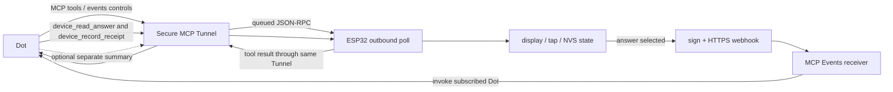

# Dot ↔ ESP32 communication specification

This document describes the current direct HTTPS implementation in this
repository. It uses **Dot** as a generic name for the connected assistant;
source filenames may retain historical `kai_companion` names. The Japanese
translation is [communication-spec.ja.md](communication-spec.ja.md).

## Scope and roles

The device is an MCP 2.0 server (protocol version `2026-07-28`) reached by a
custom ESP32 outbound poll client. OpenAI's official `tunnel-client` is a
separate PC/server client; this firmware does not run that binary. The device
opens outbound HTTPS, polls queued JSON-RPC work, and posts the response through
the same tunnel. It has no inbound public listener and no Mac relay in this
direct path.

Secure MCP Tunnel carries tool calls and subscription control. MCP Events is a
separate outbound webhook complement: it tells the subscribed Dot that a new
answer exists, but it does not replace `device_read_answer` or tool transport.
See the [official Secure MCP Tunnel guide](https://developers.openai.com/api/docs/guides/secure-mcp-tunnels)
and [official MCP Events guide](https://developers.openai.com/plugins/build/mcp-events).



The intended answer route is:

```mermaid
sequenceDiagram
  participant Dot
  participant Tunnel
  participant ESP as ESP32
  participant Events as Events receiver
  Dot->>Tunnel: queue device_publish_question
  ESP->>Tunnel: outbound HTTPS poll
  Tunnel-->>ESP: queued JSON-RPC request
  ESP->>Tunnel: tool result post
  Tunnel-->>Dot: pending result
  ESP->>ESP: render question; one tap selects a choice
  ESP->>ESP: return HOME; persist answer asynchronously in NVS
  ESP->>Events: signed device.answer webhook (bounded outbox)
  Events->>Dot: invoke subscribed Dot
  Dot->>Tunnel: queue device_read_answer(question_id)
  ESP->>Tunnel: outbound HTTPS poll
  Tunnel-->>ESP: queued JSON-RPC request
  ESP->>Tunnel: real answer result post
  Tunnel-->>Dot: answer result
  Dot->>Dot: acknowledge in ordinary chat
  Dot->>Tunnel: queue device_record_receipt
  ESP->>Tunnel: outbound HTTPS poll
  Tunnel-->>ESP: queued JSON-RPC request
  ESP->>Tunnel: received result post
  Tunnel-->>Dot: receipt result
  Dot->>Tunnel: optional separate device_publish_summary
  ESP->>Tunnel: outbound HTTPS poll, then result post
  Tunnel-->>Dot: summary result
```

## State and safety boundaries

The firmware retains one current question, one answer, one summary display,
one Events subscription, and one event outbox. It is not an unlimited answer
log. A selected answer without a receipt blocks a new question. Repeating the
same question ID with identical text and choices is idempotent; changing its
  content is a conflict. A summary can be sent separately, but it is not a
  replacement for an unanswered question. The Dot instruction protects an
  unanswered question from replacement and keeps summaries from covering it;
  that safeguard is an instruction, not a firmware invariant, so both a
  pending question and its display can technically be replaced.

Selection validates the non-empty question ID and choice ID, marks the answer
`real`,
and keeps `interaction_id`, `choice_id`, and `request_id`. The UI returns HOME
immediately. The answer NVS write is performed by the answer task before Wi-Fi
and clock gates allow network delivery; this is not a synchronous UI durability
guarantee. A local selected display is therefore separate from webhook
acceptance, Dot reading, ordinary-chat delivery, and receipt persistence.

The device accepts 1–4 choices per question and presents at most two choices
per page. Question ID and text are limited
to 128 and 4096 UTF-8 bytes respectively. Each choice has a unique `id` of at
most 48 bytes and a non-empty `label` of at most 128 bytes. Summary ID is at
most 128 bytes; summary text is non-empty and at most 24 Unicode code points
(not bytes). The firmware stores only the current values.
These are validation limits, not a guaranteed visual fit; keep prompts and
choice labels short for the 320×172 screen.

## MCP tools

| Tool | Required/input shape | Result and meaning |
| --- | --- | --- |
| `device_publish_question` | `question_id`, `text`, `choices:[{id,label}]` | Stores a pending real question. Same ID and same content is idempotent; an unreceipted answer returns `Previous answer awaits receipt`. |
| `device_publish_summary` | `summary_id`, `text` | Stores and displays a short summary. Same ID/content is idempotent; it does not acknowledge an answer. |
| `device_read_answer` | Optional `question_id` | Returns the current answer only when the scope matches. Dot must validate `source: real`, IDs, and its own published question. `source: real` identifies the firmware path; it does not prove a physical tap (serial injection can use the same path). |
| `device_record_receipt` | `interaction_id`, `choice_id`, `receipt_id`, `summary` | Persists a matching receipt. Repeating the same receipt is idempotent; a different receipt conflicts. |
| `device_status` | No arguments | Reports direct transport status and Events counters/outbox state. It does not prove Dot processing or chat delivery. |

Tool arguments use `snake_case`. Event payload fields use `camelCase`:
`question_id = answer.interaction_id = event.data.questionId`.
The event `answerId` is the stable
`questionId:choiceId:requestId` tuple. Keep `request_id` stable for retries and
derive a stable `receipt_id` from that request when recording receipt; never
invent a receipt for an unread answer.

## Synthetic examples

These are documentation fixtures, not live IDs or requests.

Question tool call:

```json
{
  "question_id": "demo-food-001",
  "text": "Lunch?",
  "choices": [{"id":"ramen","label":"Ramen"},{"id":"curry","label":"Curry"}]
}
```

Summary tool call (separate from the question):

```json
{"summary_id":"chat-001","text":"Meeting moved to 3pm"}
```

Read-answer request (tool arguments):

```json
{"question_id":"demo-food-001"}
```

Read-answer result (`structuredContent`, not a full JSON-RPC envelope):

```json
{"answers":[{"interaction_id":"demo-food-001","choice_id":"ramen","request_id":"req-001","source":"real","receipt_id":null}]}
```

Receipt tool call:

```json
{"interaction_id":"demo-food-001","choice_id":"ramen","receipt_id":"rcpt-req-001","summary":"Received Ramen"}
```

The signed `device.answer` webhook has a payload equivalent to:

```json
{
  "eventId":"evt_example",
  "name":"device.answer",
  "timestamp":"2026-01-01T00:00:00Z",
  "cursor":null,
  "data":{"answerId":"demo-food-001:ramen:req-001","questionId":"demo-food-001","choiceId":"ramen","requestId":"req-001","summary":null}
}
```

The firmware signs the exact serialized request bytes using the Standard
Webhooks HMAC-SHA256 scheme and the provisioned webhook secret. The receiver
must verify `Content-Type`, `webhook-id` (matching `eventId`),
`webhook-timestamp`, `webhook-signature`, and `X-MCP-Subscription-Id` before
invoking the subscribed Dot.

## MCP Events subscription and delivery

`initialize` and `server/discover` advertise MCP `2026-07-28`; `events/list`
advertises `device.answer` with webhook delivery and required `answerId`,
`questionId`, and `choiceId`. The endpoint implements `events/subscribe`,
`events/unsubscribe`, and `events/list` alongside tools. Subscription state is
persistent, has finite expiration, and must be refreshed before expiry. The
callback is verified by a challenge before the subscription is saved. The
implementation allows only `cursor: null`, so there is no replay of old events.
An empty `DIRECT_SUB={}` is setup scaffolding, not an active subscription.

One selected answer occupies the outbox. Delivery is attempted at most five
times. Retry delays are exponential (2, 4, 8, and 16 seconds after attempts);
the event ID remains stable while each attempt has a fresh signing timestamp.
Expiry or unsubscribe marks an active outbox `revoked`; permanent delivery
failures and the fifth failed attempt become `terminal`. HTTP 408 and 429 are
retryable exceptions to the otherwise terminal 4xx policy. An HTTP 2xx means
the callback accepted the request only. It
does not prove that a receiver ran, that Dot read the answer, that
ordinary-chat acknowledgement reached its destination, or that a receipt was
persisted. Pending local outbox retries remain possible even though event
listing uses `cursor: null` and provides no replay. There is no exact-once
guarantee; deduplicate by `eventId`/`answerId` and the
stable request tuple.

## Startup and setup checklist

1. Use the [getting started guide](getting-started.md) with a procedural demo
   character and keep credentials, runtime keys, subscription secrets, and
   generated private artwork in ignored local files.
2. Configure the official Secure MCP Tunnel and separately grant the required
   tunnel/workspace permissions. The ESP32 path remains an outbound poll
   client; do not install the PC `tunnel-client` into firmware.
3. Configure and verify a persistent `device.answer` MCP Events subscription,
   callback challenge/signature checks, expiration refresh, and `cursor: null`.
4. Give the Dot the [instruction template](dot-instructions.md), including the
   event handler: read the answer first, acknowledge it in ordinary chat, then record a
   receipt through the Tunnel. Keep optional summaries on their own path.
5. Run the synthetic two-choice round trip and correlate question/interaction
   ID, choice ID, request ID, event ID, HTTP result, Dot read, chat notice, and
   receipt. Treat each stage as confirmed, failed, unknown, or not attempted.
6. Review serial startup milestones (Wi-Fi, valid clock, first tunnel poll),
   minimum heap, and reset diagnostics. These measurements are health evidence,
   not a latency promise; battery-only stability and physical tap acceptance
   require an independent test.

For troubleshooting, see [event delivery troubleshooting](event-delivery-troubleshooting.md).
